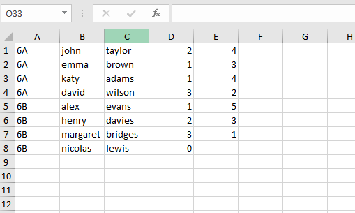
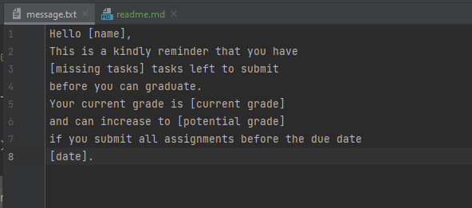

#Message generator

The following message generator was created during 2nd Hackaton with CODE:ME.
I chose this task because it can make my current job easier. 
One of my side responsibilities is to check and control if the company got back each signed contract. By using Excel and Python I could generate a messages to our subcontractors with details such as number of missing sign contracts and which orders do not relate to. 

##Table of Contents

General Info
Technologies Used
Screenshots
Setup
Project Status
Room for Improvement
Acknowledgements
Contact

##General Information

The 'message generator' is dedicated for teachers whom want to send a message to students. Below code allows to prepare messages to students from different classes by building a dictionary. One key represents one student. 
It is possible to add a function which saves messages in different files.

##Technologies Used

Windows
Python- 3.10.2

##Screenshots

##Setup

If you want to run this project you have to prepare two types of files:
-message.txt
-students.csv
File 'message.txt' consists of a sample of message that could be used by teacher. The fields which should be changed for each student were written in [].
All students' datas were saved in Excel using the csv extension. It allows to separate each column with comma.

##Project Status

Project is: complete. 

##Contact

Created by @milakow - feel free to contact me!